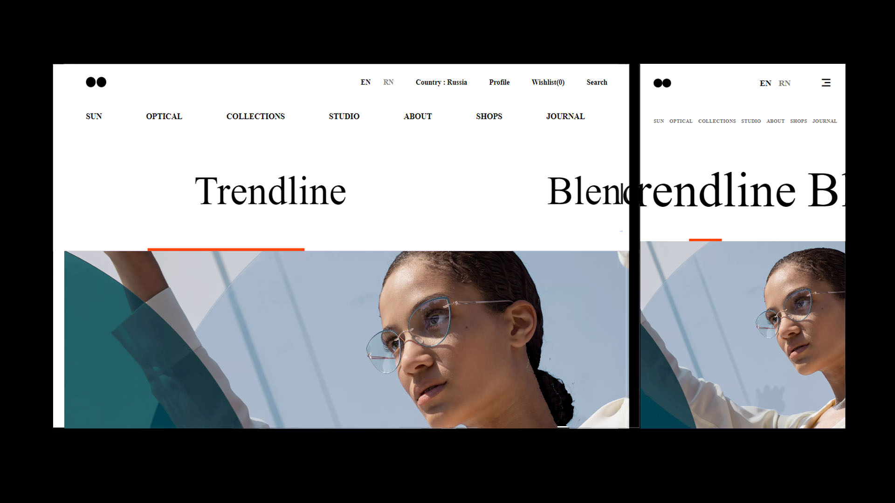

# Optical-Studio Landing Page

## Description

This project is a stylish and responsive landing page designed for a fashion portfolio. It showcases the latest jackets and brands, and provides a sleek user interface to navigate through the content.

## Features

- **Responsive Design:** Ensures a seamless experience across various devices.
- **Modern Icons:** Utilizes Remixicon for a contemporary and visually appealing set of icons.
- **Clean Code Structure:** Maintains a clean and efficient HTML and CSS code structure.

### Prerequisites

- Web browser
- Code editor (e.g., VSCode)

### Installation

1. Clone the repository.
2. Open the `index.html` file in your preferred web browser.

## Usage

Explore the fashion portfolio landing page to discover the latest trends and fashion events. Click on the menu icon to navigate through different sections.

## Built With

- HTML
- CSS
- [Remixicon](https://remixicon.com/) - For icons

## Acknowledgements

- **Instructors:** Special thanks to my dedicated instructors for their guidance and support.
- **Remixicon:** Icons used in this project are from Remixicon.

## License

This project is licensed under the [MIT License](LICENSE) - see the [LICENSE](LICENSE) file for details.
